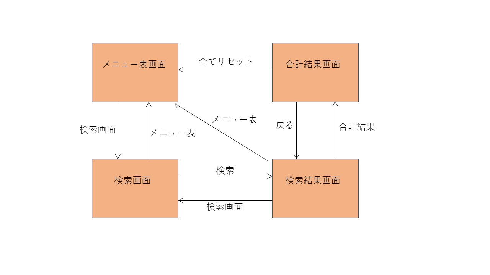

# プロダクトの名前 : dec_phese1_pos

## Auther

03\_稲岡天駿

## プロダクト URL

【↓ どちらか必須】デプロイした人は URL，画面収録の人はファイル名を記述

デプロイした場合：デプロイ先の URL

画面収録の場合：ファイル名

【↓ 必須ではない】GitHub にコードを push した人は URL を書こう

GitHub の URL：[http://localhost/](http://localhost/)へアクセス

## プロダクトの紹介

私は，現在居酒屋でアルバイトをしております．しかし，注文が手書きだったり，会計も電卓で計算したりしています．今回は，その中でも会計をする時，商品とその個数から小計と合計を計算する POS システムの様なアプリを作成しました．

## プロダクトの機能，操作方法

主な機能の紹介と操作方法を記述する．

画面収録の場合は，この手順で動画を作成する．

### 画面遷移図:

### pos アプリケーションの全体像:

### データベース：

|  id | menu               | price | class      | num | keyword              |
| --: | ------------------ | ----: | ---------- | --- | -------------------- |
|   1 | 小鉢               |   350 | お通し     | 0   | 料理こばち           |
|   2 | レバー             |   200 | みつせ鶏串 | 0   | 料理ればー           |
|   3 | トリトロ           |   220 | みつせ鶏串 | 0   | 料理とりとろ         |
| ... | ...                |    .. | ...        | ... | ...                  |
|  31 | トマトスライス     |   300 | 先発陣     | 0   | 料理トマスラとますら |
| ... | ...                |    .. | ...        | ... | ...                  |
|  77 | アサヒ生ビール     |   530 | ビール     | 0   | ドリンク飲み物       |
|  78 | アサヒ生ビール(小) |   430 | ビール     | 0   | ドリンク飲み物       |
|  79 | アサヒビン(中)     |   560 | ビール     | 0   | ドリンク飲み物       |
| ... | ...                |    .. | ...        | ... | ...                  |

## 工夫した点

検索で「トマトスライス」というメニューを調べる時に，「とまと」や「トマスラ」でも検索できるようにしました．具体的には,データベースにキーワードカラムを作成し，あいまいに検索しても探しやすい様にしました。

## 苦戦した点

苦労した点は，メニューを１つずつデータベースに登録したところです．簡単に登録する方法がありましたら，ご教授願います．

実装しようとしたけど諦めた事は，ララベルを使おうと思っていた事です．WSL2 の Vmmem プロセスがメモリを多く使っており，動作が重くなるので諦めました．また，Docker は開発環境を揃えるためのツールであり，ララベルはフレームワークなので xampp でも使えるのだろうか？という疑問も出てきた．今回は環境を壊したく無かったので，講義と同じ環境で作った．

- [http://localhost/](http://localhost/)のアクセス確認
